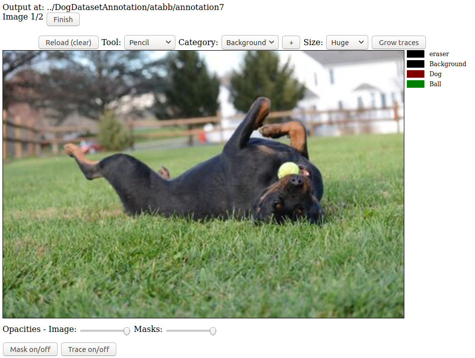

## Latest update: March 26th, 2022.
- Flexible requirements.txt
- Tested using **Python 3.8** (compilation of .c files using Cython has thrown errors for Python 3.10)
- Replaced 0.0.0.0 by localhost for mapping local files, as for the first time I've noticed that Windows/WSL can have issues mapping to 0.0.0.0

-------
FreeLabel: A Publicly Available Annotation Tool based on Freehand Traces

# Overview:
- [Paper](#underlying-ideas-the-paper)
- [Disclaimer](#disclaimer)
- [License](#license)
- [Notes](#notes-on-code-organization)
- [Requirements](#requirements)
- [Getting started](#getting-started)
   - [Installation](#installation)
   - [Accessing the annotation tool](#accessing-the-annotation-tool)    
- [Annotating a dataset](#annotating-the-demo-dataset-or-your-dataset)
   - [Input](#input)
   - [Output](#output)
   - [Convert from annotated format to classes](#convert-from-annotated-format-to-classes)
   - [Annotating your own dataset](#annotating-your-own-dataset)
- [Docker version (WIP)](#docker-version-wip) 

## Underlying ideas: the paper
This README file is to accompany code for pixel-level image annotation, lead by Philipe Dias to his paper: FreeLabel: A Publicly Available Annotation Tool based on Freehand Traces published in [WACV 2019](https://ieeexplore.ieee.org/document/8659167):

```
@INPROCEEDINGS{8659167,
author={P. A. {Dias} and Z. {Shen} and A. {Tabb} and H. {Medeiros}},
booktitle={2019 IEEE Winter Conference on Applications of Computer Vision (WACV)},
title={FreeLabel: A Publicly Available Annotation Tool Based on Freehand Traces},
year={2019},
volume={},
number={},
pages={21-30},
keywords={computer vision;image segmentation;Internet;learning (artificial intelligence);public domain software;user interfaces;freehand scribbles;FreeLabel;intuitive open-source Web interface;agricultural domain;high-quality segmentation masks;deep learning models;image understanding tasks;image segmentation datasets;large-scale annotation;freehand traces;image dataset;private annotation;crowdsourced annotation;PASCAL dataset;Image segmentation;Tools;Labeling;Training;Task analysis;Level set;Image color analysis},
doi={10.1109/WACV.2019.00010},
ISSN={1550-5790},
month={Jan},}
```
This paper is also available from arXiv:1902.06806 [cs.CV] [here](https://arxiv.org/abs/1902.06806). The arxiv version is identical in content to the IEEE version.

## Citing the code
The code may be used according to the license below.  If the results of the code are used as a part of a system described in a publication, we request that the authors cite the published paper at a minimum. 

### Disclaimer
**This project is the first experience of the involved students with Javascript and Django. Despite our efforts to keep it fairly organized and functional, there is significant room for improvement. We appreciate any feedback for improving the tool, but cannot provide any type of support/warranty.**

Comments / concerns / problems: please submit a Github issue (preferred method) or email the team at freelabelcontact@gmail.com.

### License
Available under the Non-Profit Open Software License: for more details https://opensource.org/licenses/NPOSL-3.0.

## Notes on code organization 
check Notes_on_FreeLabel.pdf

## Requirements
- python3 and corresponding pip3
- virtualenv, which can be installed through 'pip install virtualenv' (see https://virtualenv.pypa.io/en/latest/installation/)

# Getting started 

## Installation
1. clone repository. `git clone --branch main --depth 1 https://github.com/philadias/freelabel.git`
2. enter the repository directory, `cd freelabel/`.
3. Create a directory for the python environment and cd, `mkdir python-env`, `cd python-env`.
4. create virtual environment: `virtualenv .` (if you have multiple python versions, run: `virtualenv -p python3 .`)
5. enter virtual environment: `source ./bin/activate`. 
6. Return to the level 0 of the repository structure, `cd ..`. 
5. install requirements: `pip install -r requirements.txt` (if it fails, try upgrading pip: `pip install --upgrade pip`)
6. Recompile callRGR: 
	- `cd freelabel` (so the path is `freelabel/freelabel`)
	- `python setup.py build_ext --inplace`
	- `cd ..`
	
7. run Django project: `python manage.py runserver localhost:9000`

## Accessing the annotation tool
1. access [http://localhost:9000/freelabel/](http://localhost:9000/freelabel/)
2. register user/password (no need for email)
2. login with registered user
3. Done!

# Annotating the demo dataset or your dataset.

### Setup.

First, set up your dataset.  The format is that there is a directory of image files with any of the extensions `.jpg`,  `.png`, `.JPG`, or `jpeg`. 

There is also a text file named `categories.txt` with the categories to be annotated.  The maximum number of categories is 20, plus the background category. 

There is a demo dataset in this repository called `DogDataset`.  Here, the contents of `categories.txt` are:

```
Background
Dog
Ball
```

To add to this list of file types, edit `views.py`, where there are lines such as, 

```python
files_ = glob.glob(os.path.join(localFolder,"*.jpg"))
```

### Output.

The colors are assigned to the categories in the `categories.txt` file automatically according to the [PASCAL VOC](http://host.robots.ox.ac.uk:8080/pascal/VOC/pubs/everingham10.pdf) encoding. One can download the development kit from [PASCAL VOC](http://host.robots.ox.ac.uk/pascal/VOC/voc2012/index.html#devkit) [here -- 500KB tar file](http://host.robots.ox.ac.uk/pascal/VOC/voc2012/VOCdevkit_18-May-2011.tar).

Below, is an altered version of the colormap-generating matlab file (which one of us ran in open-source [octave](https://www.gnu.org/software/octave/index)).  Run with `cmap  = labelcolormap(256);` to generate the colormap for the class indexes.  A text file, `lut.txt` will be generated with the red, green, blue values written to each line to the file (also contained in `/static/readme-tutorial/lut.txt` of this repository). Another file with the LUT in OpenCV blue, green, red and numpy format is at `static/images/PASCALlut.npy`, and can be acccessed by loading in python, `lut = np.load('static/images/PASCALlut.npy')`.

```matlab
% VOCLABELCOLORMAP Creates a label color map such that adjacent indices have different
% colors.  Useful for reading and writing index images which contain large indices,
% by encoding them as RGB images.
%
% CMAP = VOCLABELCOLORMAP(N) creates a label color map with N entries.
% notes from A. Tabb. Run this function with N = 256.
function cmap = labelcolormap(N)

fileID = fopen('lut.txt','w');
if fileID==-1
  error('Cannot open file for writing: %s', file);
end

if nargin==0
    N=256
end
cmap = zeros(N,3);
for i=1:N
    id = i-1; r=0;g=0;b=0;
    for j=0:7
        r = bitor(r, bitshift(uint64(bitget(id,1)),7 - j));
        g = bitor(g, bitshift(uint64(bitget(id,2)),7 - j));
        b = bitor(b, bitshift(uint64(bitget(id,3)),7 - j));
        id = bitshift(id,-3);
    end
    cmap(i,1)=r; cmap(i,2)=g; cmap(i,3)=b;
    fprintf(fileID,'%u %u %u\n', cmap(i,:));   %i %i\n',r, g, b);
    
end

fclose(fileID);
```
For example, the first 21 classes have the following colors, from top to bottom:


### Convert from annotated format to classes

An annotated image with 2 PASCAL VOC classes, plus background.


Once the images are annotated with the FreeLabel tool, you may want to convert back to images with the class labels.  Here is code to do so, which is also contained in the `load-labels.py` file. You would call it with `python3 load-labels.py filename.png` 

```python
#!/usr/bin/env python
import sys

import cv2 as cv
import numpy as np


def lut2index_refactor(color_image, lut):
    height = np.size(color_image, 0)
    width = np.size(color_image, 1)

    labels_image = np.zeros((height, width), np.uint8)

    bi, gi, ri = cv.split(color_image)
    lut = np.uint8(lut)

    # enumerate is a nice function, when you need both element and index:
    for i, color in enumerate(lut[:-1]):
        b, g, r = color.flatten()  # split the lut into 3 vars
        mask = (bi == b) & (ri == r) & (gi == g)  # evaluate whether image is == lut at i
        labels_image[mask] = i  # labels_image = class index @ mask
    return labels_image


lut = np.load('static/images/PASCALlut.npy')

color_image = cv.imread(sys.argv[1])

label_img = lut2index_refactor(color_image, lut)

cv.imwrite("labels_image.png", label_img)

```


### Annotating your own dataset.

After you have logged in as a registered user,

1. Underneath "Annotate a custom dataset", click "From scratch".


2. Enter the dataset to annotation. There is a dataset to use as a demo, `DogDataset`, in the repository.


3. Select the annotation session label name. Here, I choose `annotation7`.


4. Enter the output directory for the saved files. I chose a location outside of the repository directory, `../DogDatasetAnnotation`


5. Start annotating the first image.  The top displays the output directory: `../DogDatasetAnnotation/atabb/annotation7`.  The category is set to background, tool size is Huge. The categories are shown on the right side of the screen.


6. I chose to mark the background first, using huge and normal-sized pencil tools.


7. Then, I marked the dog and ball categories.


8. I clicked the `Grow traces` button on the upper right side of the frame to get this result. The segmentation is mostly good, but there are regions of inaccuracy.


9. So then I refined the segmentation by annotating more `background` and `dog` regions where there oversegmentations -- the dog's front legs, as well as its back legs. 


10. Then I clicked `Grow traces` again to get this result, which I am happy with.  I click the `Finish` button at the top to finish with this image only, and then another image will load. 


Here is the result from this annotation, saved with the same filename as the original image, in the output directory.


A similar image, with transparency set as the background, will also be saved.  The filename has `-transparency.png` as the suffix, and it otherwise the same as the original image filename.


# Docker version (WIP)

*We have been working on a Docker version, but it is not quite operational.*

We provide a Dockerfile to capture the installation requirements for the project.  Some care is needed when using it -- the docker image needs to be mounted from the cloned freelabel repository on your local disk.  Please read for details. 

## Setup

The first two steps are the same as the typical setup.

1. clone repository. `git clone --branch main --depth 1 https://github.com/philadias/freelabel.git`
2. enter the repository directory, `cd freelabel/`.
3. `sudo docker build -t freelabel-docker . `

Then, the dataset to be annotated must reside in the current directory `freelabel`, or at a level below `freelabel` because of the way the volume will be mounted.  The demo dataset, `./DogDataset` satisfies this requirement.

## Run

Run the docker image, 

```bash 
sudo docker run -v $PWD:/usr/bin/freelabel/  --network="host" -it freelabel-docker python3 manage.py runserver localhost:9000 
```

and open the annotation tool at [http://localhost:9000/freelabel](http://localhost:9000/freelabel) in a web browser.  Register and login like described in [Annotating your own dataset](#annotating-your-own-dataset). Note that:
- the bind mount `-v $PWD:/usr/bin/freelabel/` is very specific in this case and must be copied exactly, 
- the source dataset must be a subdirectory of the cloned freelabel directory.
- and the output directory, where the annotations are stored, but also be a subdirectory of the cloned freelabel directory. 


